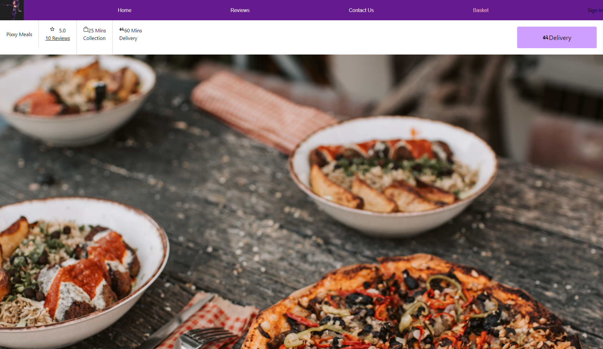
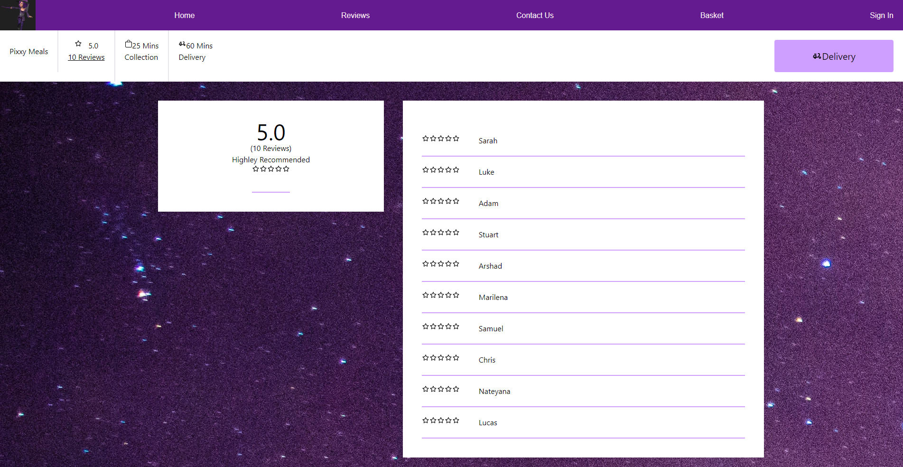
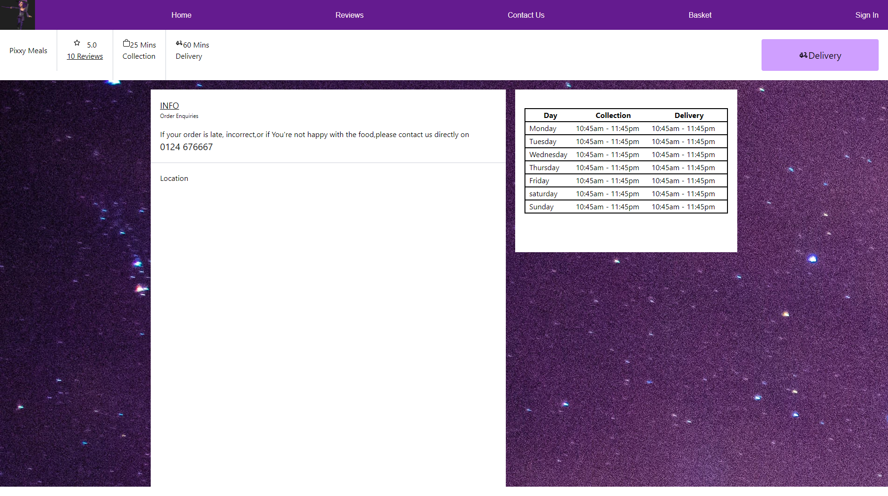
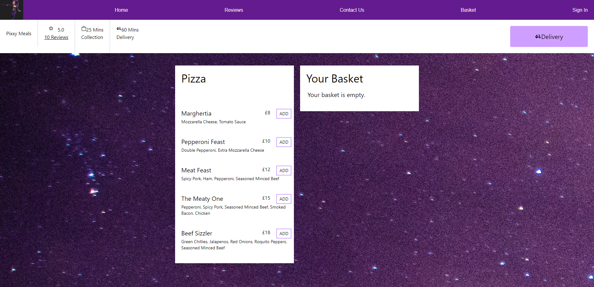
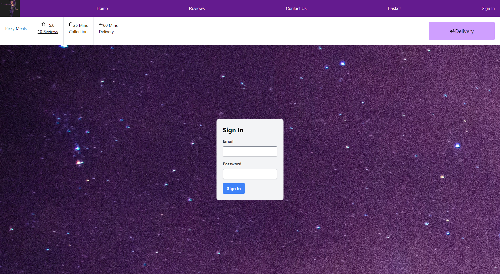
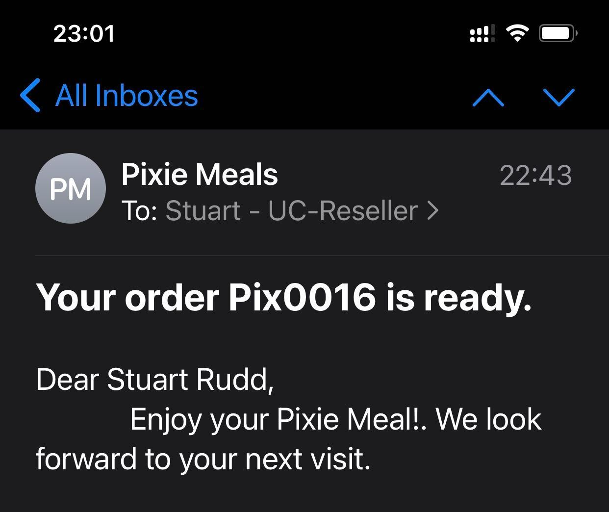
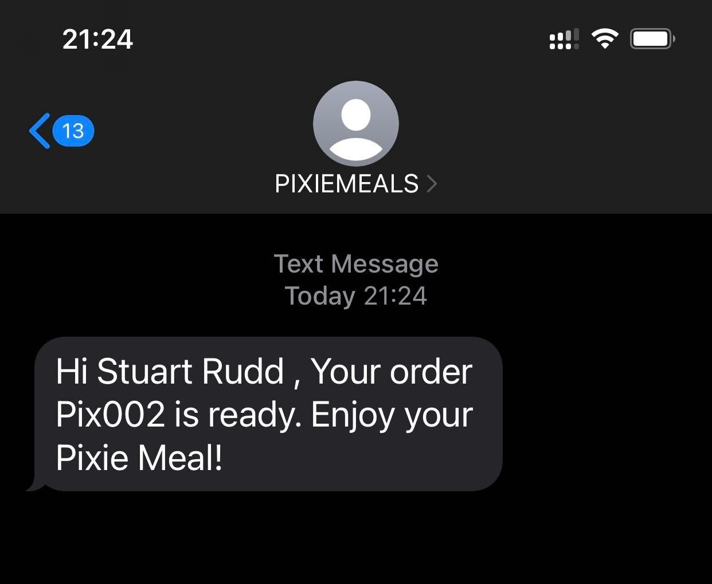

# UoB_Final_Project_Pixie-Meals

##Table of contents:
  1. [Description](#description)
  2. [Technologies](#technologies)
  3. [Components](#components)  
  4. [Components content](#components-content)
  5. [Installation](#installation)
  6. [Screenshots](#screenshots)
  7. [Presentation](#presentation)
  8. [Links](#links)
  9. [Resources](#resources)
  
## Description
Develop an application that would allow users to select items from the meals and drinks menu and add them to the basket. 
When the order is ready, the app will notify the customer, by sending a voice message on their phone, an SMS or an email.
The user can leave their name and choose whether they want to receive order confirmation via phone, SMS or email. 

## Technologies
* [React.js](https://legacy.reactjs.org/)
* [Node.js](https://nodejs.org/)
* [Node Asterisk](https://www.npmjs.com/package/asterisk.io)
* [Node mailer](https://www.npmjs.com/package/nodemailer)
* [Linphone](https://www.linphone.org/)
* [Email to SMS service](https://ucsms.co.uk/)
* [Tailwind](https://tailwindcss.com/)
* Navigation with React Router, dynamic rendering
* CSS.
* [Express appplication](https://expressjs.com/en/starter/hello-world.html)
* [Netlify](https://www.netlify.com/) to deploy this React application
* [Git](https://git-scm.com/)
* [Github]()
* [Figma] (https://www.figma.com/file/cFWQOkFxzWHhTXaKMWQdWi/OnCallApp?node-id=0-1&t=o1XcrtZ9PHb33k77-0)
* GET and POST routes for retrieving and adding new data.

 ## Components

  * Home

  * Header

  * Navbar

  * Contact form

 ### Components Content

 * Home:

A welcome landing page that contains:

 - A summary of what the app is doing
 
 - An image to represent site's activity

 * Header:

  - It is rendered across the entire site.

  - It contains a Navbar.

  * Navbar:

 It renders all the children components such as:

 - Order

  - Reviews

 - Contact us

  - Basket 

  - Sign In

* Body
  
  - Menu
 
 * Contact us:

 - A contact form created in React.

Then we can have:
* Footer with contact links 

 - E-mail
 - Mobile phone
 - LinkedIn
 - GitHub
-  Sign in form
## Installation
To use this app, the used needs to install the dependencies below:.\
[Create React App documentation](https://facebook.github.io/create-react-app/docs/getting-started) Run *npx-create-react-app* in Terminal
[React route DOM](https://www.npmjs.com/package/react-router-dom)
## Available Scripts

In the project directory, you can run:
### `npm start`
Runs the app in the development mode.\
### `npm test`
Launches the test runner in the interactive watch mode.\

### `npm run build`
Builds the app for production to the `build` folder.\
It correctly bundles React in production mode and optimizes the build for the best performance.

The build is minified and the filenames include the hashes.\
Your app is ready to be deployed!

### `npm run eject`
**Note: this is a one-way operation. Once you `eject`, you can't go back!**
If you aren't satisfied with the build tool and configuration choices, you can `eject` at any time. This command will remove the single build dependency from your project.

Instead, it will copy all the configuration files and the transitive dependencies (webpack, Babel, ESLint, etc) right into your project so you have full control over them. All of the commands except `eject` will still work, but they will point to the copied scripts so you can tweak them. At this point you're on your own.

## Screenshots

 * Screenshot of the deployed application

 

  

* App output: Message sent to confirm that order is ready:

 

## Presentation

[powerpoint presentation](assets/Presentation/UoB_project_management_PixieMeals.pdf)

[pdf](assets/Presentation/UoB_project_management_PixieMeals.pptx)

## Links
Links to submitted items:

* The URL of the GitHub repository: 
https://github.com/ucstuart/UoB_Final_Project_On_Call

 
 ## Resources:
  
 * [Node Asterisk](https://www.npmjs.com/package/asterisk)

 * [DOM vs Virtual DOM](https://reactjs.org/docs/faq-internals.html%20-%20https://medium.com/devinder/react-virtual-dom-vs-real-dom-23749ff7adc9)
 
 * [React's documentation components and props](https://reactjs.org/docs/components-and-props.html)

 * [‘useEffect’ in react](https://dev.to/colocodes/6-use-cases-of-the-useeffect-reactjs-hook-282o)

 * [React router](https://reactrouter.com/en/main)

 * [Version control](https://git-scm.com/doc)
 * [Git branches](https://learngitbranching.js.org/?locae&locale=en_US)
 * [Presentermedia](https://www.presentermedia.com/)
  * [Create React App](https://github.com/facebook/create-react-app).
 * Open [http://localhost:3000](http://localhost:3000) to view it in your browser.
  * [Running tests](https://facebook.github.io/create-react-app/docs/running-tests)
 * [Deployment](https://facebook.github.io/create-react-app/docs/deployment)

